# Friengage - A Social Networking Platform

This project was bootstrapped with [Create React App](https://github.com/facebook/create-react-app).

## Run all the Commands One after the other

In the project directory, you can run:

### `npm start`

Runs the app in the development mode.\
Open [http://localhost:3000](http://localhost:3000) to view it in the browser.

In the server directory, you can run:

### `nodemon app`

Runs the node server so that backend and frontend both can connect .\

In the socket directory, you can run:

### `npm start`

Runs the socket.io server for realtime communication.\

## Some Snapshots of Web App

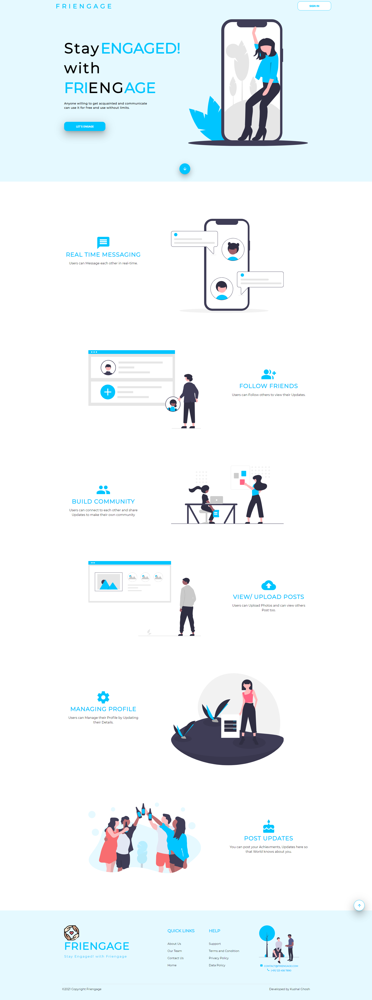
**Landing Page**

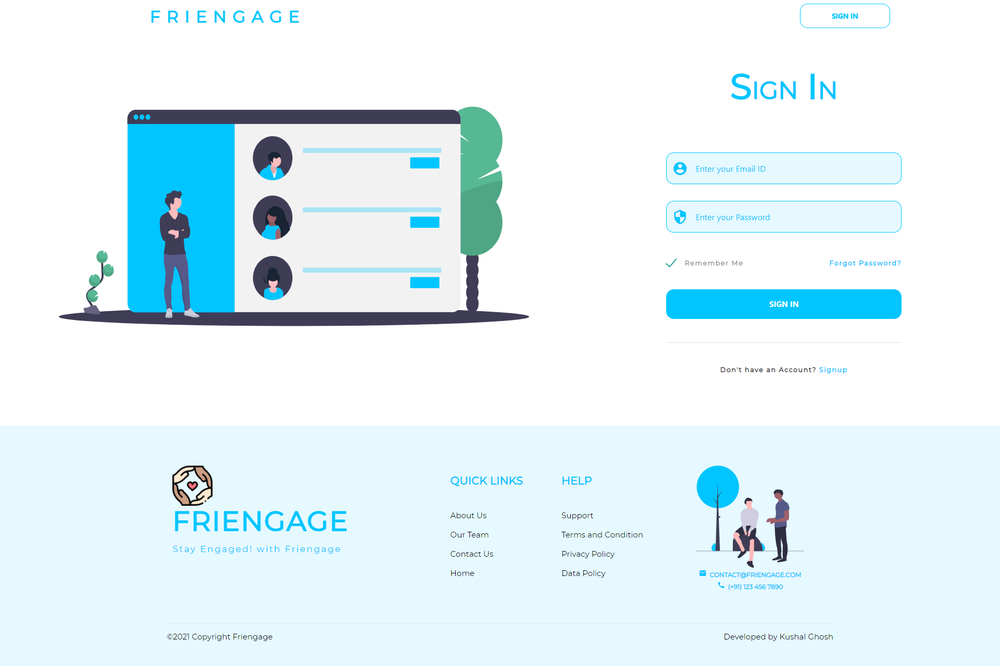
**Sign In Screen**

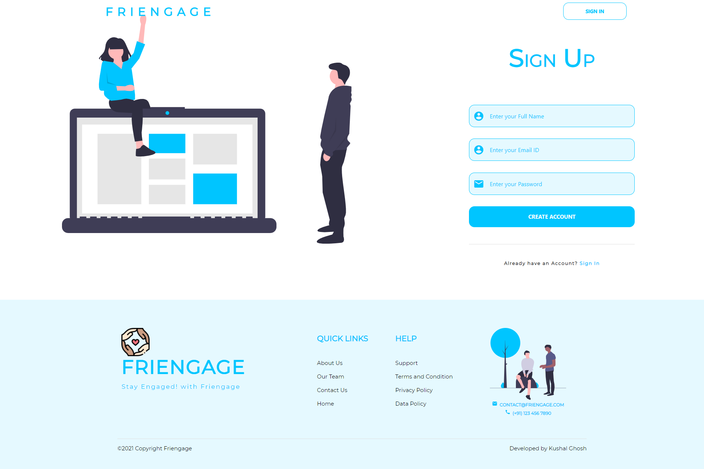
**Signup Screen**

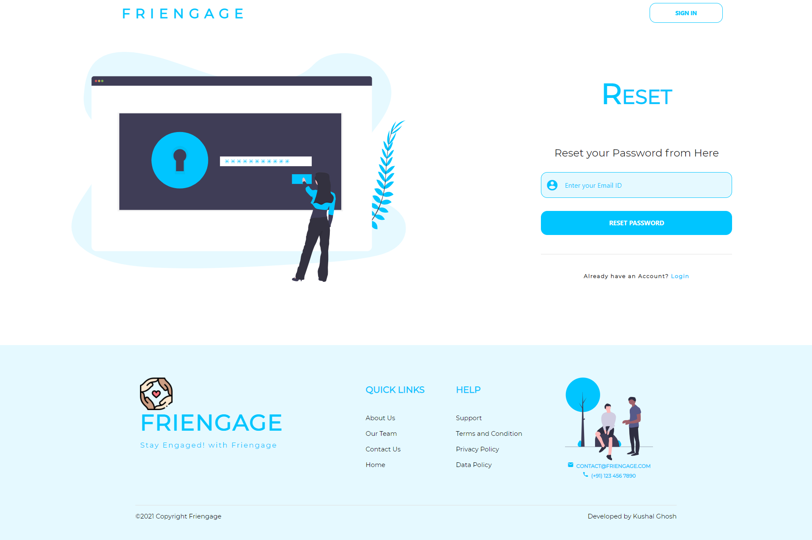
**Reset Password Screen**

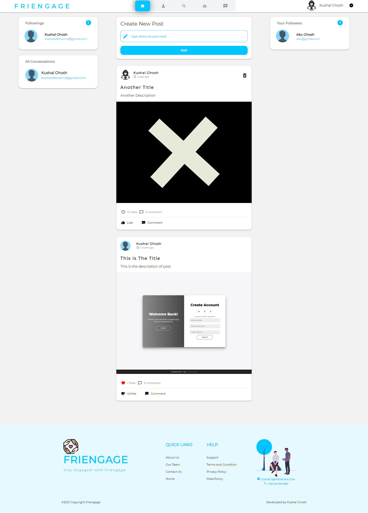
**News Feed/ Home Screen**

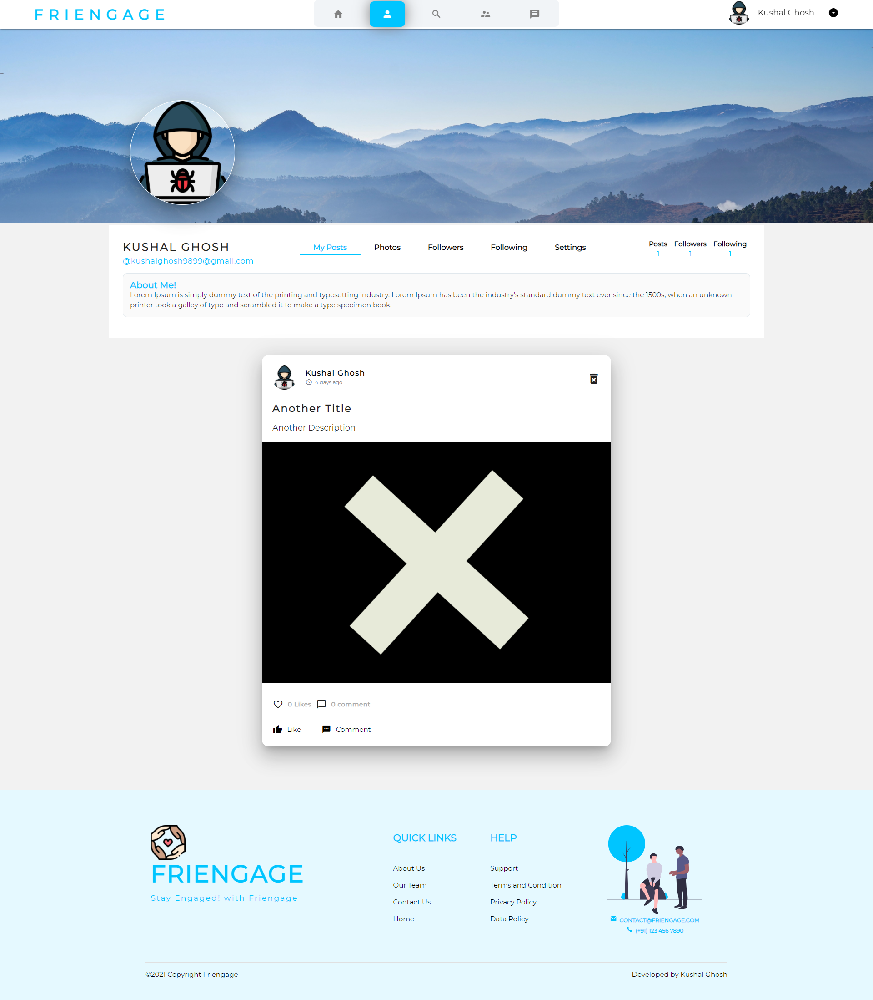
**My Profile All Posts Tab**

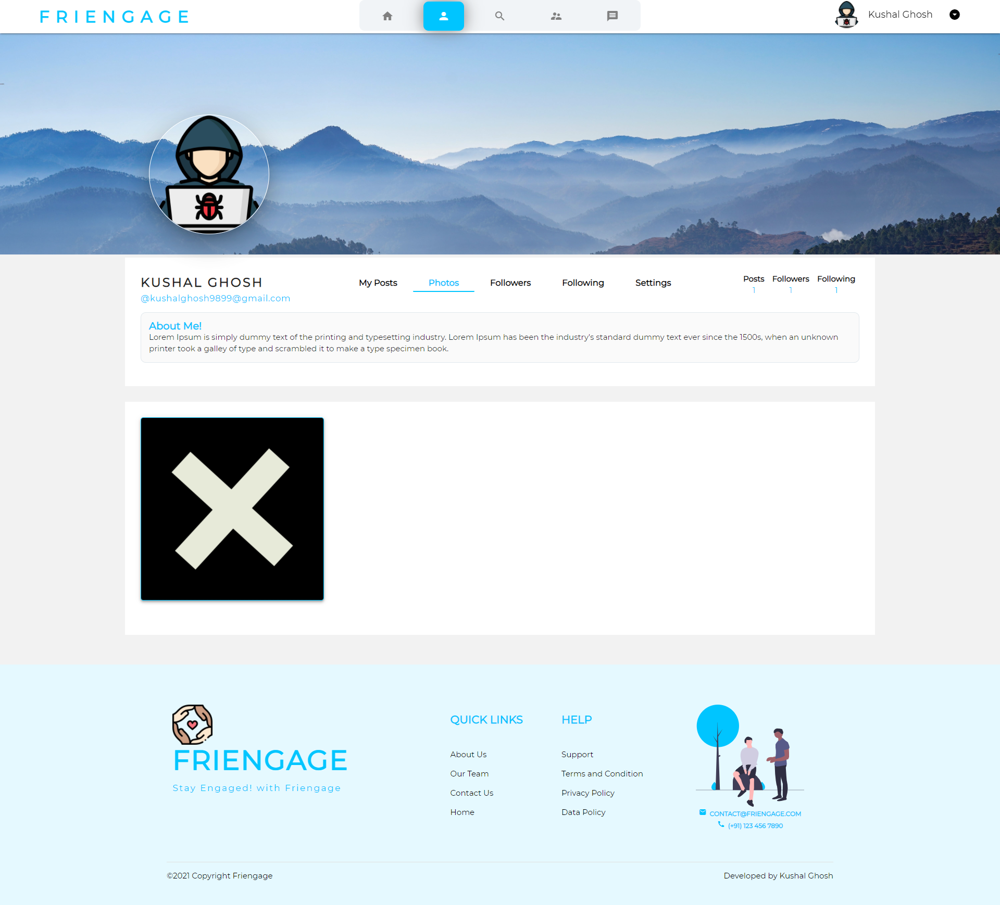
**My Profile Gallery Tab**

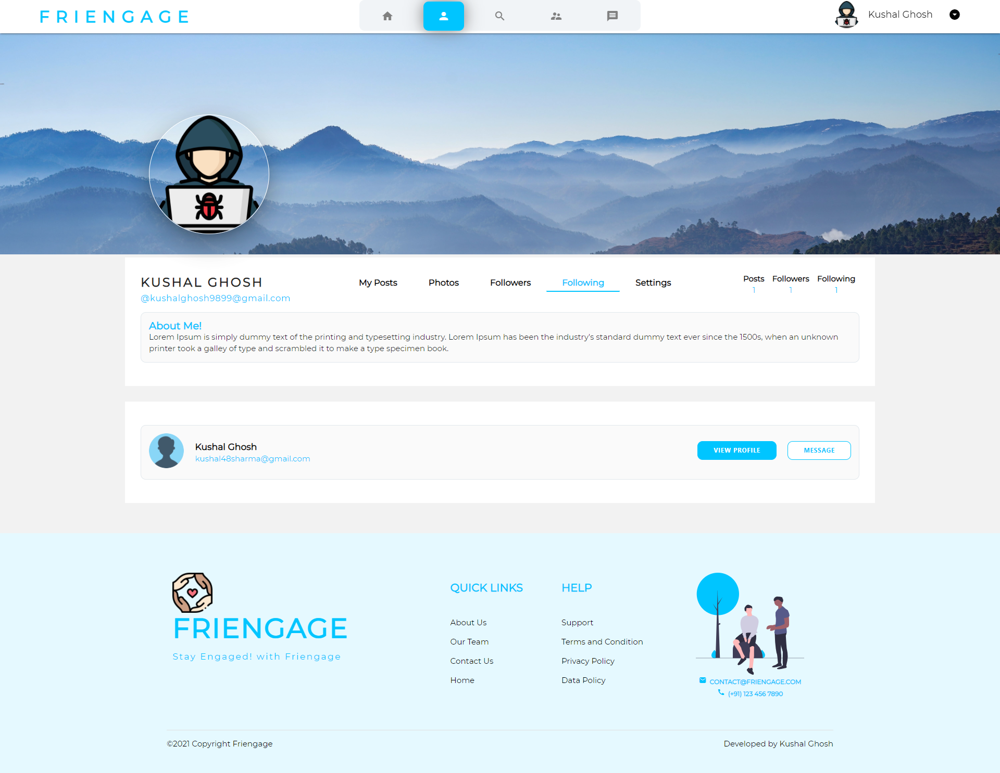
**My Profile Followings Tab**

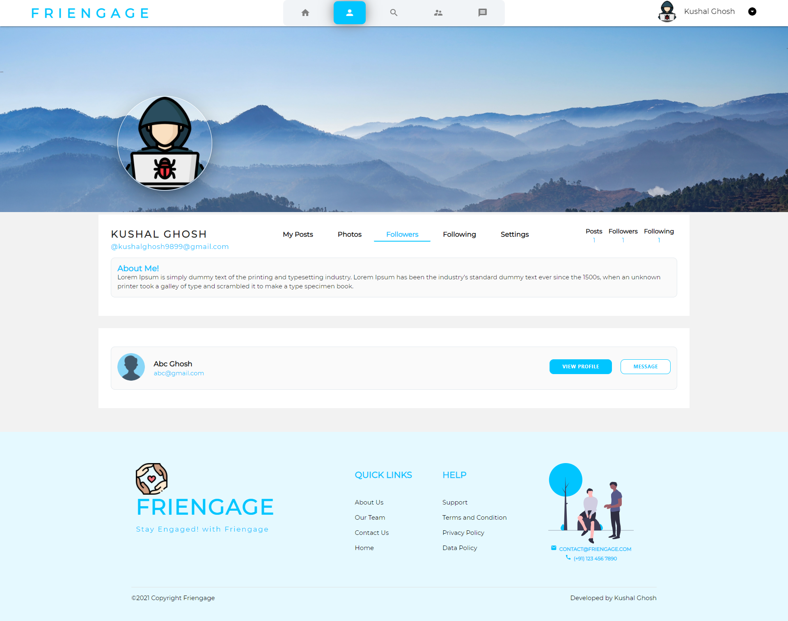
**My Profile Followers Tab**

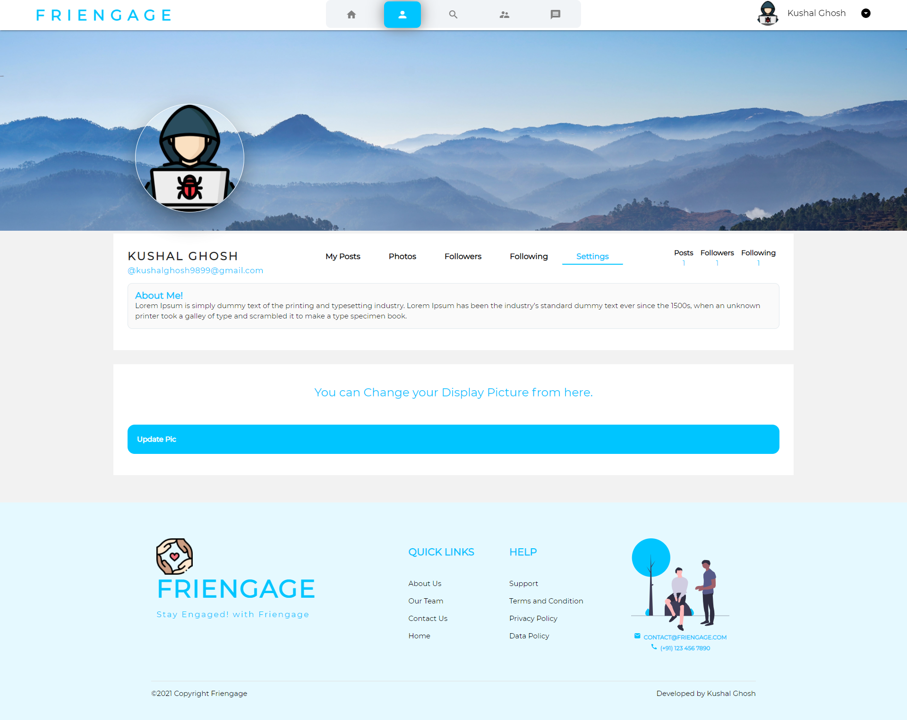
**My Profile Settings Tab**

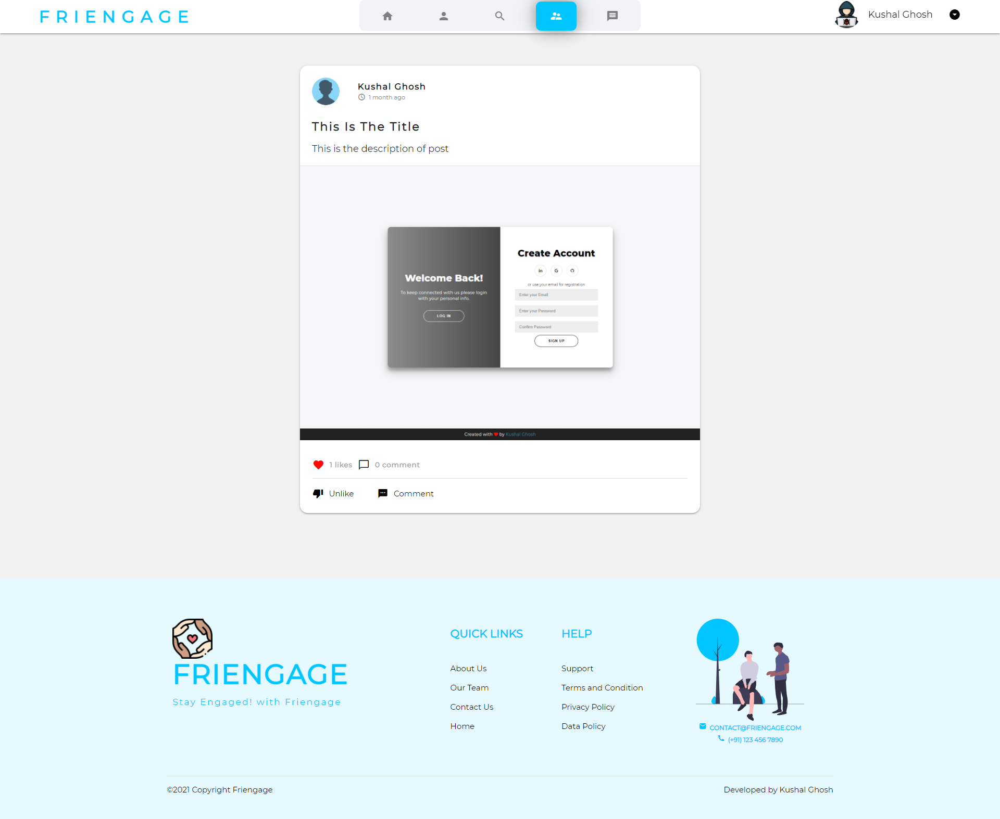
**Followings Post**

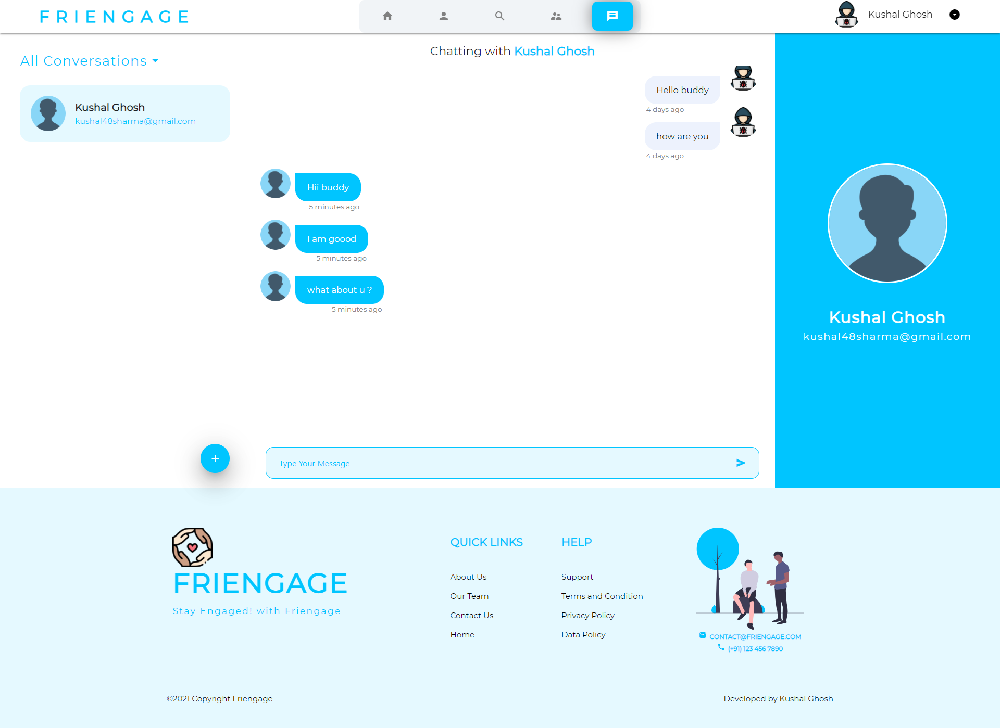
**All Messages**

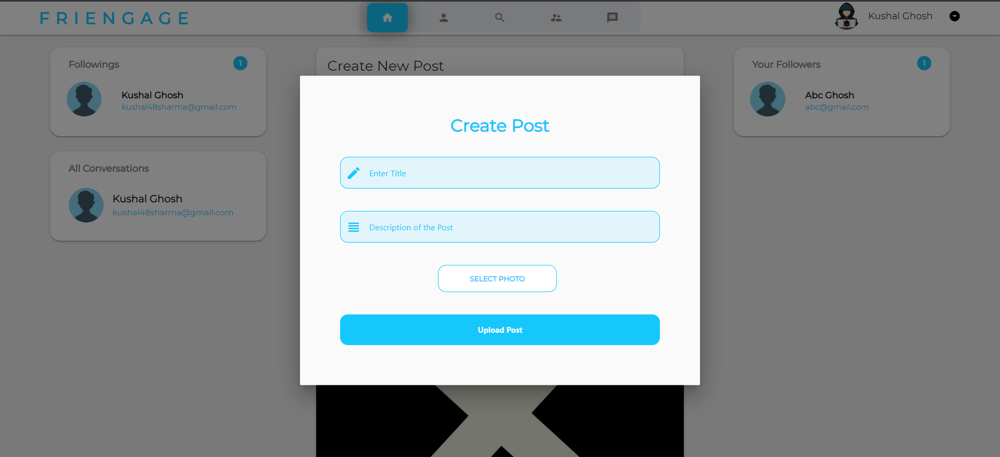
**Create Post/ Upload Post**

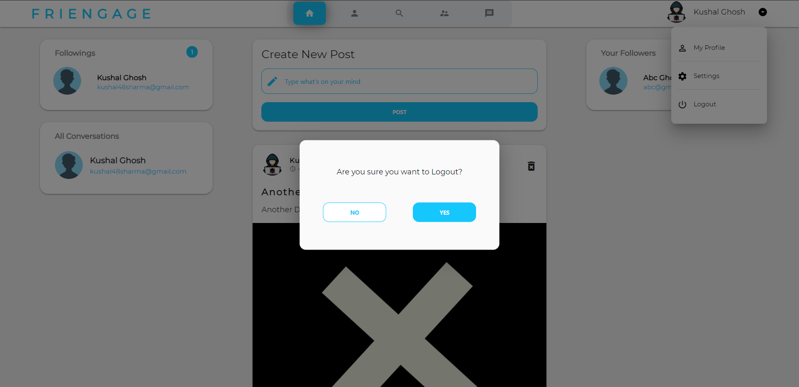
**Logout Screen**
